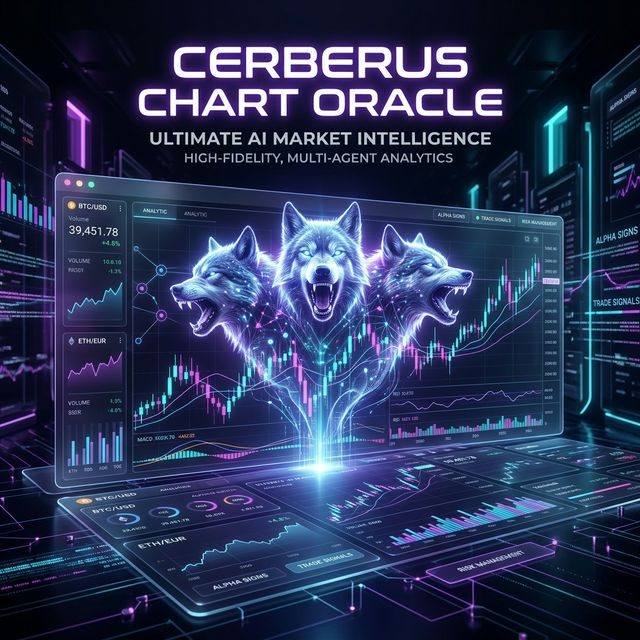

<div align="center">


<br>

<h2>🚧 Project Under Maintenance 🚧</h2>

<p>
This project is currently undergoing major improvements, bug fixes, performance optimizations,
and feature enhancements.
</p>

<p>
⚠️ Some features may be unstable or temporarily unavailable.
</p>

<p>
Thank you for your patience and support.
</p>

</div>

<div align="center">
  
  <h1>⚡ CERBERUS CHART ORACLE: GODCORE ⚡</h1>
  <p><b>The Ultimate Multi-Agent Financial Intelligence Swarm</b></p>
  <p>
    <a href="https://github.com/yourusername/cerberus-chart-oracle">
      
    </a>
    
    
  </p>
</div>

<br>

## 👁️ Vision Overview

Cerberus Chart Oracle is a state-of-the-art visual intelligence system designed for professional traders. It leverages a **12-agent synchronized swarm** to analyze market charts, detect sophisticated SMC (Smart Money Concepts) patterns, and generate high-probability trade signals with institutional-grade reasoning.

<div align="center">
  
  <p><i>The Cerberus Godcore Dashboard: Real-time neural terminal updates and intelligent analysis.</i></p>
</div>

### 🌟 Key Capabilities

<table align="center">
  <tr>
    <td align="center" width="50%">
      <h3>🧠 Multi-Agent Orchestration</h3>
      <p>A hierarchy of specialized agents (Vision, Strategy, Risk, etc.) collaborate to reach a unified consensus, providing unparalleled depth in analysis.</p>
    </td>
    <td align="center" width="50%">
      <h3>🎨 Neural Annotator</h3>
      <p>Automatically overlays Take Profit (TP), Stop Loss (SL), and Market Structure levels directly onto your chart images for visual clarity.</p>
    </td>
  </tr>
  <tr>
    <td align="center">
      <h3>🛡️ Adaptive Vision</h3>
      <p>Seamlessly fails over from OpenAI GPT-4o Vision to Gemini 1.5 Flash if API limits are reached, ensuring zero downtime.</p>
    </td>
    <td align="center">
      <h3>🖥️ Godcore UI</h3>
      <p>A high-fidelity, glassmorphic web dashboard providing real-time "Neural Terminal" updates for every agent step.</p>
    </td>
  </tr>
</table>

<br>

<div align="center">
  
  <p><i>Precision Smart Money Concepts (SMC) AI Annotations applied directly to live charts.</i></p>
</div>

---

## 🏗️ System Architecture

The core of Cerberus operates on a synchronous data pipeline driven by modular agents.

<div align="center">
  
</div>

---

## 🚀 Quick Start

### 1. Prerequisites
- **Python 3.9+** 
- OpenAI and/or Gemini API Keys

### 2. Installation
```bash
# Clone the repository
git clone https://github.com/CerberusMrX/cerberus-chart-oracle.git
cd "Cerberus Chart Oracle"

# Set up virtual environment
python3 -m venv venv
source venv/bin/activate  # Linux/macOS

# Install dependencies
pip install -r requirements.txt
```

### 3. Configuration
Copy `.env.example` to `.env` and fill in your API keys:
```bash
cp .env.example .env
```

### 4. Running the Oracle
**Web Mode (Recommended)**
```bash
python3 main.py --server
# Access at http://localhost:5000
```

---

<div align="center">
  <h2>🛠️ Tech Stack</h2>
  <p>
    
    
    
    
  </p>
  <p>© 2026 Cerberus Intelligent Systems | Designed By Sudeepa Wanigarathna</p>
</div>
